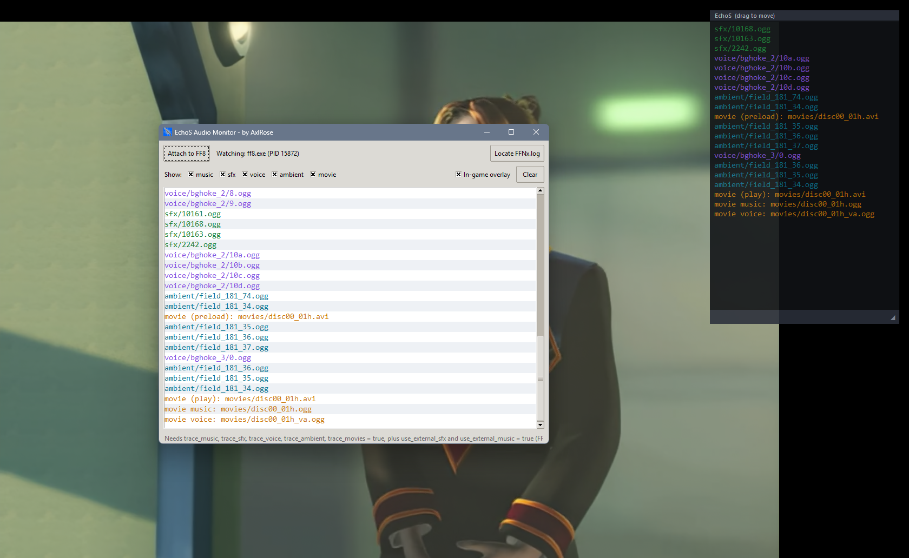

# FF8 Audio Monitor



FF8 Audio Monitor shows you, live, every audio file Final Fantasy VIII asks for while you play: music, sound effects, voices, ambient sounds and movie audio. It's made mainly for people working on audio mods, like replacing music tracks, SFX or voices (it was built for the EchoS project), so you always know which file is playing and which one you need to replace.

FFNx already writes all of this to `FFNx.log`, but it's buried in everything else FFNx logs, the file grows fast, and you end up reopening and searching it every time you want to check something. This app does all of that for you. It finds the running game and its log on its own, keeps only the audio lines, skips the repeats and gives each type its own color. You can hide the types you don't need, turn on a small overlay that floats over the game so you don't have to Alt+Tab, copy lines, or open a saved log to see every file it used.

It's a modding tool, not a companion app or a trainer. It only reads `FFNx.log` and never touches the game or its memory.

It has only been tested with FFNx and the Junction VIII mod manager, on Final Fantasy VIII Remastered and the original 2013 Steam version, and those are the only setups it supports.

## Download

Get `echos_audio_monitor.zip` from the [latest release](https://github.com/AxlRose-RX/FF8-Audio-Monitor/releases/latest), unzip it anywhere and run `echos_audio_monitor.exe`. Keep the `_internal` folder next to the .exe.

## FFNx settings

Turn these on in `FFNx.toml` so FFNx logs the audio:

```toml
trace_music = true
trace_sfx = true
trace_voice = true
trace_ambient = true
trace_movies = true
```

Music and SFX also need these, in `FFNx.toml` or in your mod's `mod.xml`:

```toml
use_external_sfx = true
use_external_music = true
```

Then start the game through Junction VIII and click **Attach to FF8**.

## Build it yourself

Download **Source code (zip)** from any release, install [Python 3](https://www.python.org/downloads/) and double-click `build_exeonedir.bat`. It installs everything it needs and builds the app into `dist\echos_audio_monitor`.

## Credits

Made by AxlRose. Claude (Anthropic's AI) helped write the code.

Questions and bug reports: [Tsunamods Discord](https://discord.com/invite/7Rsvsewghz)
